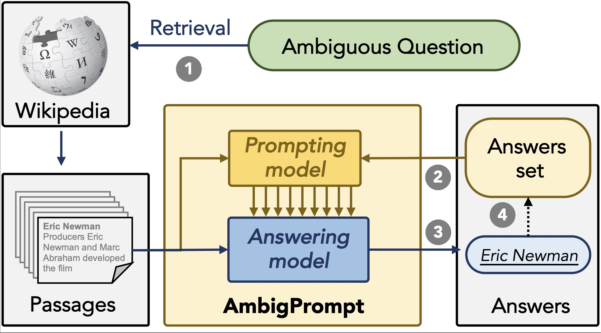

# AmbigPrompt

Code for paper [Answering Ambiguous Questions via Iterative Prompting](https://aclanthology.org/2023.acl-long.424/).



## Prepare Data
Download the Wikipedia text splitted by 100 words from [DPR](https://dl.fbaipublicfiles.com/dpr/wikipedia_split/psgs_w100.tsv.gz), put it under `data/wikipedia/psgs_w100.tsv`, and run the following command to build Wikipedia's redis cache.
```bash
python tool.py
```

Download NQ and AmbigNQ data from [shmsw25/AmbigQA](https://github.com/shmsw25/AmbigQA) and put it under `data/nq` and `data/ambig`

## Train Retrieval Model

Training a dense passage retrieval model using [luyug/dense](https://github.com/luyug/Dense)
```bash
python train_dense.py
```

Encode the passages and perform passage retrieval using [Faiss](https://github.com/facebookresearch/faiss).
```bash
python inference_dense.py
```

This step obtains QA data that includes the 100 retrieved passages, like [`data/ambig/dev.json`](https://github.com/sunnweiwei/AmbigPrompt/blob/main/data/ambig/dev.json).

## Train QA Model
Download the pre-trained checkpoint from [facebookresearch/FiD](https://github.com/facebookresearch/FiD).

Train the prompting model and QA model on multi-answer QA data:
```bash
accelerate launch train.py --data_path data/ambig/train.json --save_path out/ambig/model --do_train true --do_eval false
```

Evaluate the model:
```bash
accelerate launch train.py --data_path data/ambig/dev.json --checkpoint out/ambig/model/9.py --do_train false --do_eval true
```

## Cite
```
@inproceedings{Sun2023IsCG,
  title={Answering Ambiguous Questions via Iterative Prompting},
  author={Weiwei Sun and Hengyi Cai and Hongshen Chen and Pengjie Ren and Zhumin Chen and Maarten de Rijke and Zhaochun Ren},
  booktitle={ACL},
  year={2023},
}
```


